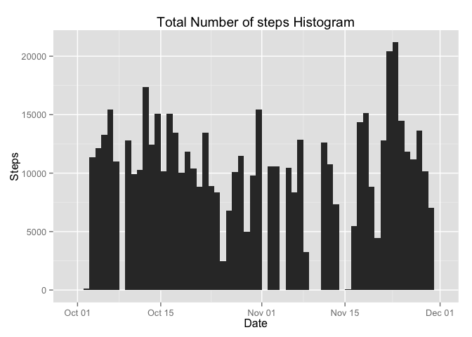
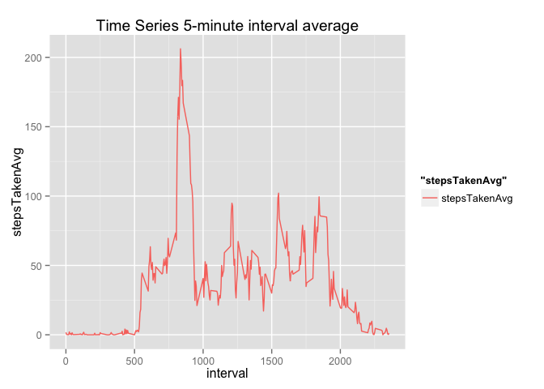
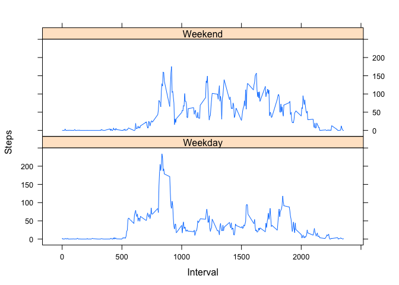

# Reproducible Research: Peer Assessment 1
Fabricio Nascimento  
10/18/2015  

##Downloading Activity Data

```r
#install.packages("tools","plyr","ggplot2","data.table","latice")
library(tools)
library(plyr)
library(ggplot2)
library(data.table)
library(lattice)

datasetMD5 <- "61e0c1f8c4a736ff1ab0f8863344b301"

if(!file.exists("activity.zip") || (md5sum("activity.zip") != datasetMD5)){
  print("Downloading Activity DataSet.")
  dataFileUrl <- "https://d396qusza40orc.cloudfront.net/repdata%2Fdata%2Factivity.zip"
  download.file(dataFileUrl,"activity.zip")
} else {
  print("Activity DataSet already available.")
}
```

```
## [1] "Activity DataSet already available."
```

```r
if(!file.exists("activity.csv")){
  unzip("activity.zip")
}
```

## Loading and preprocessing the data

1.Load the data (i.e. read.csv())

```r
dataTypes = c("numeric","Date", "numeric")
activities <- read.csv("activity.csv", colClasses = dataTypes)
head(activities)
```

```
##   steps       date interval
## 1    NA 2012-10-01        0
## 2    NA 2012-10-01        5
## 3    NA 2012-10-01       10
## 4    NA 2012-10-01       15
## 5    NA 2012-10-01       20
## 6    NA 2012-10-01       25
```

2.Process/transform the data (if necessary) into a format suitable for your analysis
(Done close to where the data is used)

## What is mean total number of steps taken per day?
1. Calculate the total number of steps taken per day

```r
stepsPerDay <- aggregate(activities$steps, by=list(activities$date), FUN=sum)
colnames(stepsPerDay) <- c("Day", "Steps Taken")
head(stepsPerDay)
```

```
##          Day Steps Taken
## 1 2012-10-01          NA
## 2 2012-10-02         126
## 3 2012-10-03       11352
## 4 2012-10-04       12116
## 5 2012-10-05       13294
## 6 2012-10-06       15420
```
2. Make a histogram of the total number of steps taken each day

```r
#TODO: Vertical lines for median and mean would be great
histogramPlotActivity <- function(data){
  plt <- ggplot(activities, aes(x=date))
  plt <- plt + geom_histogram(aes(weight=steps), binwidth = 1)
  plt <- plt + ylab('Steps')
  plt <- plt + xlab('Date')
  plt <- plt + ggtitle('Total Number of steps Histogram')
  #plt <- plt + geom_vline(aes(xintercept = mean(stepsPerDay$'Steps Taken', na.rm = TRUE)), color='red')
  plt
}

histogramPlotActivity(activities)
```

 

3.Calculate and report the mean and median of the total number of steps taken per day

```r
#TODO: Format is kind of not great
meanSteps <- mean(stepsPerDay$'Steps Taken', na.rm = TRUE)
medianSteps <- median(stepsPerDay$'Steps Taken', na.rm = TRUE)
```
**Mean**: 1.0766189\times 10^{4}  
**Median**: 1.0765\times 10^{4}

## What is the average daily activity pattern?
1. Make a time series plot (i.e. type = "l") of the 5-minute interval (x-axis) and the average number of steps taken, averaged across all days (y-axis)

```r
stepsPerIntervalAVG <- aggregate(activities$steps, by=list(activities$interval), FUN=mean, na.rm=TRUE)
colnames(stepsPerIntervalAVG) <- c("interval", "stepsTakenAvg")
print(head(stepsPerIntervalAVG))
```

```
##   interval stepsTakenAvg
## 1        0     1.7169811
## 2        5     0.3396226
## 3       10     0.1320755
## 4       15     0.1509434
## 5       20     0.0754717
## 6       25     2.0943396
```

```r
plt <- ggplot(stepsPerIntervalAVG, aes(x=interval, y=stepsTakenAvg, group=1, colour="stepsTakenAvg"))
plt <- plt + geom_line()
plt <- plt + ggtitle('Time Series 5-minute interval average')
plt
```

 

2. Which 5-minute interval, on average across all the days in the dataset, contains the maximum number of steps?

```r
stepsPerIntervalSUM <- aggregate(activities$steps, by=list(activities$interval), FUN=sum, na.rm=TRUE)
colnames(stepsPerIntervalSUM) <- c("interval", "stepsTakenSUM")
maxStepsInterval <- stepsPerIntervalSUM[order(stepsPerIntervalSUM$stepsTakenSUM, decreasing = TRUE),][1,1]
```

Interval whose sum of steps is max, is **835**.

## Imputing missing values
1.Calculate and report the total number of missing values in the dataset (i.e. the total number of rows with NAs)

```r
totalCases <- nrow(activities)
completeCases <- sum(complete.cases(activities))
missingCases <- totalCases - completeCases
```
Case Counting:  
- **Total Cases**: 17568  
- **Complete Cases**: 15264  
- **NA Cases**: 2304  

2.Devise a strategy for filling in all of the missing values in the dataset.
*(Using substitution by the interval average)*

```r
  replaceNA <- function(x) {
    if(is.na(x['steps'])){ 
      return(stepsPerIntervalAVG$stepsTakenAvg[stepsPerIntervalAVG$interval == as.numeric(x['interval'])])
    }
    return(x['steps'])
  }
```

3.Create a new dataset that is equal to the original dataset but with the missing data filled in.

```r
  fixedActivities <- activities
  fixedActivities$steps <- apply(activities,1,replaceNA)
  head(activities)
```

```
##   steps       date interval
## 1    NA 2012-10-01        0
## 2    NA 2012-10-01        5
## 3    NA 2012-10-01       10
## 4    NA 2012-10-01       15
## 5    NA 2012-10-01       20
## 6    NA 2012-10-01       25
```

```r
  head(fixedActivities)
```

```
##                steps       date interval
## 1   1.71698113207547 2012-10-01        0
## 2  0.339622641509434 2012-10-01        5
## 3  0.132075471698113 2012-10-01       10
## 4  0.150943396226415 2012-10-01       15
## 5 0.0754716981132075 2012-10-01       20
## 6   2.09433962264151 2012-10-01       25
```

4. Make a histogram of the total number of steps taken each day and Calculate and report the mean and median total number of steps taken per day. Do these values differ from the estimates from the first part of the assignment? What is the impact of imputing missing data on the estimates of the total daily number of steps?

```r
  histFixed <- histogramPlotActivity(fixedActivities)
  histNorm <- histogramPlotActivity(activities)
```
### Data with NA

```r
print(histNorm)
```

 

###Data withouth NA

```r
print(histFixed)
```

 

**It does not look like chaginng the missing values for the average, changed the histogram much.**
## Are there differences in activity patterns between weekdays and weekends?
1.Create a new factor variable in the dataset with two levels – “weekday” and “weekend” indicating whether a given date is a weekday or weekend day. 

```r
  weekPartition <- function(date){
    if(date %in% c('Saturday', 'Sunday')){ return('Weekend') }
    return('Weekday')
  }

  activitiesDT <- data.table(activities)
  activitiesDT$dayname <- weekdays(activitiesDT$date)
  activitiesDT$dayClass <- as.factor(apply(as.matrix(activitiesDT$dayname), 1, weekPartition))
  summaryForPlot <- activitiesDT[, list(avgSteps = mean(steps, na.rm = T)), by = list(interval, dayClass)]

  head(summaryForPlot)
```

```
##    interval dayClass  avgSteps
## 1:        0  Weekday 2.3333333
## 2:        5  Weekday 0.4615385
## 3:       10  Weekday 0.1794872
## 4:       15  Weekday 0.2051282
## 5:       20  Weekday 0.1025641
## 6:       25  Weekday 1.5128205
```

2.Make a panel plot containing a time series plot (i.e. type = "l") of the 5-minute interval (x-axis) and the average number of steps taken, averaged across all weekday days or weekend days (y-axis).

```r
xyplot(avgSteps~interval | dayClass, data = summaryForPlot, type = 'l', ylab = 'Steps', xlab = 'Interval', layout = c(1,2))
```

 

**(PHEW, that was a hard one)**
